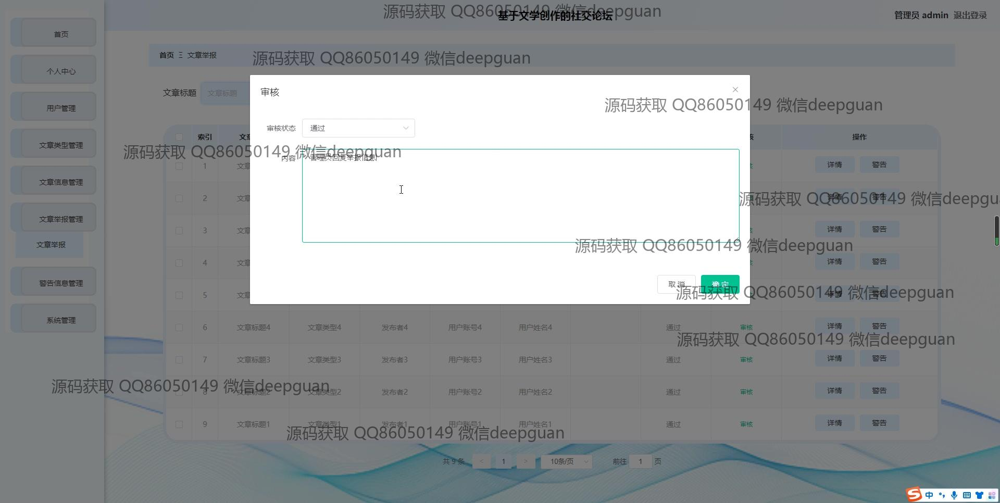
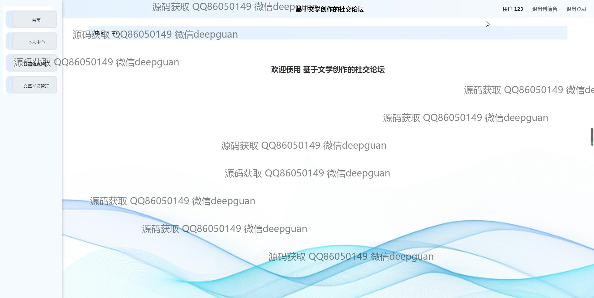

<h1 align="center">基于文学创作的社交论坛</h1>

## 简介
基于文学创作的社交论坛：系统角色分为管理员和用户；主要功能包括用户注册与登录、文章管理、举报处理、文章发布与评论、系统公告、和在线客服。旨在提供一个交流、分享与创作灵感的平台。    --计算机毕业设计源码；毕设源码；java毕业设计源码

## 联系方式

<h3 align="center">获取完整代码与数据库文件 + 微信：deepguan QQ: 86050149 QQ群: 783742310</h3>

<h3 align="center">可帮忙远程部署 包运行成功！提供远程部署、修改代码、设计文档指导、代码讲解等服务！</h3>

## 功能介绍（完整见运行截图）
管理员： 管理员可以登录社交论坛的后台管理系统，通过导航菜单管理用户、文章类型和文章举报，并处理文章审核与举报。管理员能够发布和管理系统公告，上传图片，编写公告内容及系统简介，高效管理论坛内容。文章管理界面允许查看文章详情及用户评论，支持文章的删除与互动处理，帮助推动论坛的健康发展。

用户： 用户需通过注册和登录界面创建账户，体验文学论坛的多种功能。用户可以发布和评论文学作品，浏览文章类型和参与文学讨论，收藏和点赞感兴趣的作品，同时通过搜索功能查找特定内容。个人中心提供个人信息管理和创作记录查看，提高用户的互动体验，便于用户参与和分享文学创作。

## 运行截图

本代码来源于网络,仅供学习参考使用!

